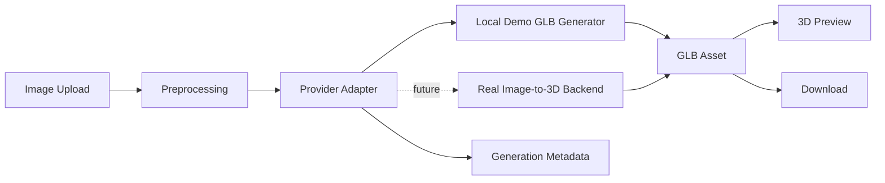

# Agentic 3D Asset Studio

Agent-ready Hugging Face Space for turning image inputs into downloadable 3D assets.

This project is an application layer around image-to-3D workflows. It includes a polished Gradio UI, a working local `.glb` demo generator, generation metadata, and `agents.md` instructions so coding agents can call the Space safely.

> This repository does not claim to train a proprietary 3D foundation model. The architecture is designed to plug into real image-to-3D backends such as TRELLIS, TripoSR, Stable Fast 3D, InstantMesh, or a private inference endpoint.

## What It Shows

- image upload workflow for 3D asset generation
- `.glb` export
- browser-based 3D preview through Gradio `Model3D`
- provider interface for swapping local demo generation with a real model backend
- deterministic generation metadata for auditability
- agent-readable usage instructions
- Hugging Face Space-ready structure

## Run Locally

```bash
python -m venv .venv
.venv\Scripts\activate
pip install -r requirements.txt
python app.py
```

Open the local Gradio URL shown in the terminal.

## Hugging Face Space

Create a new Space with:

- SDK: `Gradio`
- App file: `app.py`
- Hardware: CPU for demo mode, GPU for real model adapters

Then push this repository to the Space.

## Architecture



## Portfolio Pitch

I built an agent-ready 3D asset generation Space with image upload, `.glb` export, model backend abstraction, generation metadata, and instructions for automated agent workflows.

## Roadmap

- add TRELLIS/TripoSR provider adapter
- add texture generation pipeline
- add mesh simplification controls
- add generation history with SQLite
- add API usage examples for agents and CI workflows
