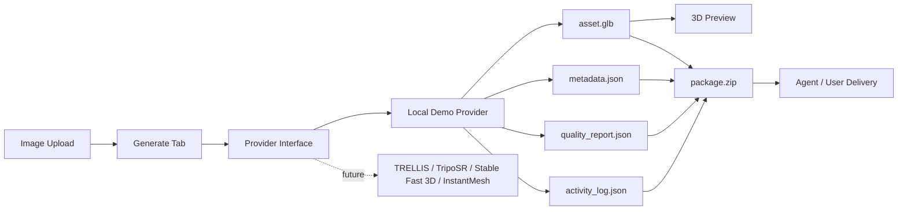

# Agentic 3D Asset Studio

Premium, agent-ready 3D asset generation workspace built with Python and Gradio.

The app turns an uploaded image into a complete local asset package:

```text
image upload -> provider adapter -> GLB preview -> metadata.json -> quality_report.json -> activity_log.json -> package.zip
```

> Important: this project does **not** claim to train or run a proprietary foundation image-to-3D model. The active provider is a deterministic local demo generator. The architecture is prepared for future real backends such as TRELLIS, TripoSR, Stable Fast 3D, InstantMesh, or a private inference endpoint.

## Product Pitch

Agentic 3D Asset Studio is an agent-ready 3D asset generation workspace with image upload, GLB generation, browser preview, asset history, metadata, quality scoring, audit logs, ZIP export packages and agent-readable instructions.

It focuses on the application and workflow layer around AI asset generation:

- provider abstraction
- durable asset outputs
- metadata and auditability
- rule-based quality diagnostics
- asset package export
- agent constraints and schemas
- premium operator-facing UI

## What It Does

- uploads a source image
- generates a deterministic demo `.glb` asset through the Local Demo Provider
- previews the GLB in the browser with Gradio `Model3D`
- saves every generated asset under `outputs/assets/{asset_id}/`
- exports `metadata.json`
- exports `quality_report.json`
- exports `activity_log.json`
- creates a ZIP package with all deliverables
- lists generated assets in an Assets section
- documents agent usage through `agents.md`

## What It Does Not Claim

This app does not claim that the generated mesh is:

- produced by TRELLIS, TripoSR, Stable Fast 3D, InstantMesh or another real image-to-3D model
- production-ready
- game-ready
- CAD-ready
- validated by a real 3D geometry QA system

The current quality score is a **rule-based demo quality layer**. It checks workflow completeness and basic output properties. Human review is required before production use.

## Architecture



## Output Structure

```text
outputs/
  assets/
    asset_xxxxxxxxxx/
      asset.glb
      metadata.json
      quality_report.json
      activity_log.json
      input.png
      agent_instructions.md
      package.zip
```

## Provider Model

Provider code lives in:

```text
providers/
  base.py
  local_demo.py
```

Active provider:

- `Local Demo Provider`
- provider type: `deterministic_demo`
- backend: `procedural-glb-demo`

Future provider targets:

- TRELLIS
- TripoSR
- Stable Fast 3D
- InstantMesh

## Run Locally

```bash
python -m venv .venv
.venv\Scripts\activate
pip install -r requirements.txt
python app.py
```

Open:

```text
http://127.0.0.1:7860
```

## Deploy as Hugging Face Space

Create a new Hugging Face Space:

- SDK: `Gradio`
- App file: `app.py`
- Hardware: CPU for Local Demo Provider
- Hardware: GPU only when adding a real image-to-3D model backend

Push the repository to the Space. The app is dark-only and uses `agents.md` as an agent-readable usage guide.

## Agent-Ready Workflow

Agents should:

1. validate that the user has rights to use the image
2. upload the image
3. call `generate_3d_asset`
4. inspect metadata and quality report
5. return the GLB and ZIP package
6. report provider and limitations

Agents must not claim real foundation image-to-3D generation unless a real provider is configured.

## Screenshots

Add screenshots here after deployment:

```text
docs/assets/generate-screen.png
docs/assets/assets-screen.png
docs/assets/agents-screen.png
```

## Portfolio Pitch

I built an agent-ready 3D asset generation workspace with image upload, GLB preview, durable asset history, provider abstraction, metadata export, rule-based quality reports, ZIP asset packages and `agents.md` instructions for automated workflows. The current provider is a deterministic local demo backend, and the architecture is prepared for real image-to-3D models such as TRELLIS, TripoSR, Stable Fast 3D or InstantMesh.
