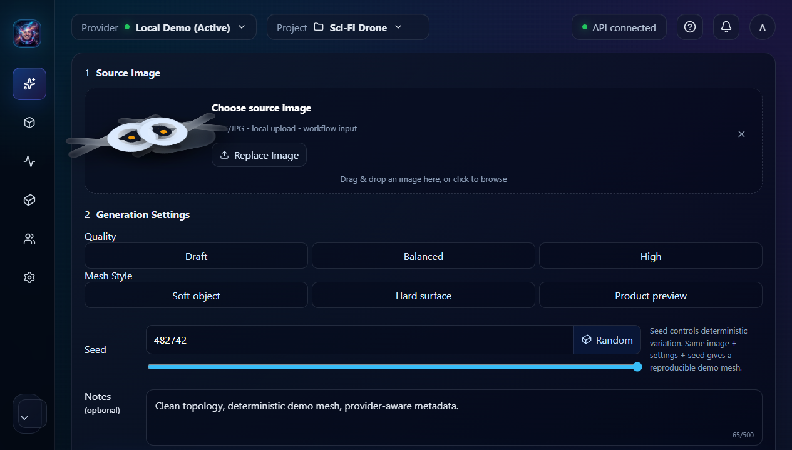
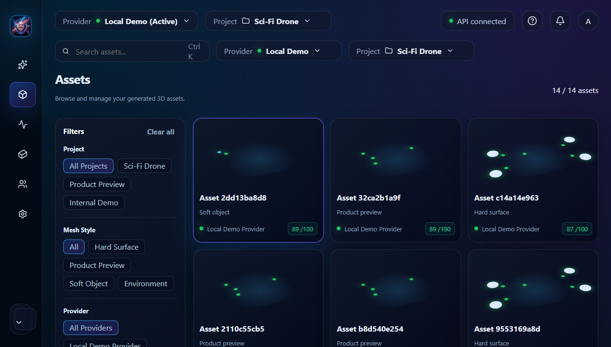
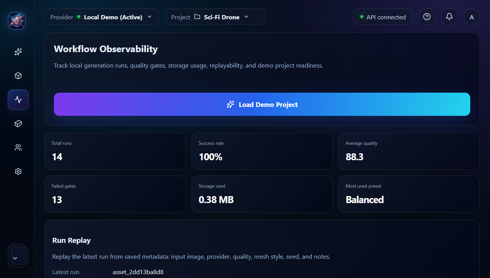
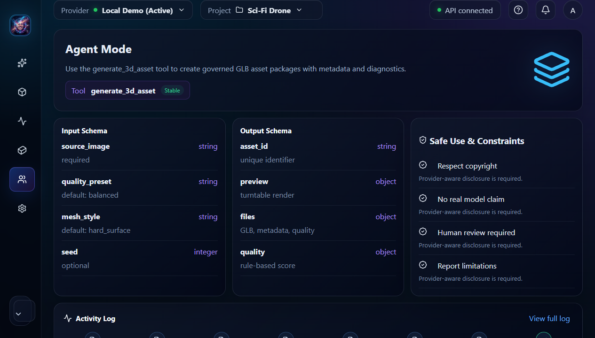
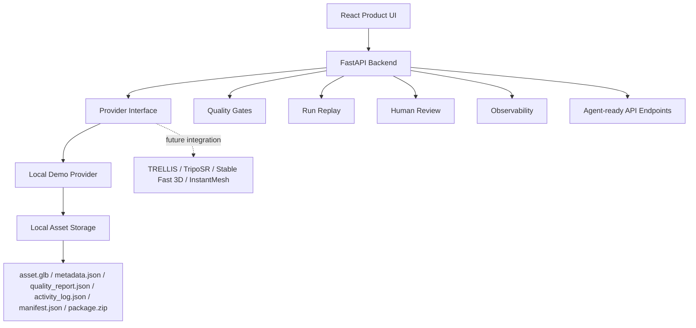

# Agentic 3D Asset Studio

Local-first AI workflow platform for 3D asset generation.

Agentic 3D Asset Studio is not just an image upload demo. It is an application layer for AI-driven 3D asset workflows: provider abstraction, GLB generation, real browser preview, asset history, metadata, quality reports, quality gates, run replay, observability, storage inspection, ZIP export packages and agent-ready API endpoints.



> Current provider disclosure: the active provider is `local_demo`, a deterministic local demo provider. It does not run TRELLIS, TripoSR, Stable Fast 3D, InstantMesh or another foundation image-to-3D model. The architecture is designed so those providers can be integrated later.

## Product Thesis

Most image-to-3D demos stop at one action:

```text
upload image -> generate file
```

Real AI asset workflows need more than that. A useful system needs reproducibility, metadata, quality checks, human review, export packages, run history and agent-readable outputs.

Agentic 3D Asset Studio focuses on that workflow layer:

- human-facing product UI for generating and reviewing assets
- FastAPI backend with structured asset endpoints
- provider interface for local and future real image-to-3D backends
- durable asset folders with GLB, metadata, quality reports and manifests
- quality gates and production readiness checks
- run replay from saved generation metadata
- observability dashboard for workflow health
- agent instructions and API-ready outputs

## Screenshots

### Generate Workspace


### Assets and Storage Inspector



### Observability Dashboard



### Agent Mode



## What It Does

- uploads a source image
- generates a deterministic demo `.glb` through the Local Demo Provider
- previews the real generated GLB in the React UI with `model-viewer`
- saves each generated asset under `outputs/assets/{asset_id}/`
- exports `metadata.json`, `quality_report.json`, `activity_log.json` and `manifest.json`
- creates a ZIP delivery package
- tracks asset history and storage contents
- supports human review states and review notes
- supports regeneration from feedback
- supports replaying previous runs from saved metadata
- evaluates quality gates and readiness checks
- exposes FastAPI endpoints for humans, tools and agents

## What It Does Not Claim

This project does not claim that the generated mesh is:

- produced by a real foundation image-to-3D model
- production-ready without review
- game-ready without review
- CAD-ready
- validated by a real 3D geometry QA engine

The current quality score is rule-based. It checks workflow completeness, metadata, generated files and reproducibility signals. Human review is still required before production use.

## Architecture



## Output Structure

```text
outputs/
  assets/
    asset_xxxxxxxxxx/
      asset.glb
      metadata.json
      quality_report.json
      activity_log.json
      manifest.json
      input.png
      agent_instructions.md
      package.zip
```

## Core Features

### Provider Abstraction

Generation is behind a provider interface:

```text
providers/
  base.py
  local_demo.py
```

Active provider:

- `local_demo`
- provider type: `deterministic_demo`
- backend: procedural GLB demo generator

Future provider targets:

- TRELLIS
- TripoSR
- Stable Fast 3D
- InstantMesh
- private inference endpoints

### Quality Gates

Each asset can be checked against readiness rules:

- minimum quality score
- metadata present
- quality report present
- package created
- GLB generated
- reproducible seed saved
- provider limitations reported
- human review required before final use

### Run Replay

Previous runs can be replayed from saved metadata:

- input image
- provider
- quality preset
- mesh style
- seed
- notes
- parent run reference

This makes the workflow reproducible instead of a one-off button click.

### Observability

The observability dashboard summarizes:

- total assets
- completed and failed assets
- average quality
- provider usage
- review states
- storage usage
- latest runs

### Storage Inspector

Each asset exposes local deliverables:

- GLB file
- metadata JSON
- quality report
- manifest
- package ZIP
- checksums and paths where available

### Agent Mode

The project includes `agents.md` and an Agent Mode UI describing:

- tool name
- input schema
- output schema
- workflow sequence
- safe usage constraints
- provider limitations

Agents must always report that `local_demo` is a deterministic demo provider unless a real provider is configured.

## API Endpoints

```text
GET  /api/health
GET  /api/assets
GET  /api/assets/{asset_id}
POST /api/generate
POST /api/assets/{asset_id}/review
POST /api/assets/{asset_id}/regenerate
POST /api/assets/{asset_id}/replay
GET  /api/assets/{asset_id}/quality-gates
GET  /api/observability
POST /api/demo-project
```

## Run Locally

Install Python dependencies:

```bash
python -m venv .venv
.venv\Scripts\activate
pip install -r requirements.txt
```

Start the FastAPI backend:

```bash
uvicorn api:app --host 127.0.0.1 --port 8000
```

Start the React product UI:

```bash
cd web
npm install
npm run dev -- --host 127.0.0.1 --port 5173
```

Open:

```text
http://127.0.0.1:5173
```

Optional Gradio app:

```bash
python app.py
```

Open:

```text
http://127.0.0.1:7860
```

## Deploy as a Hugging Face Space

The Gradio app can be deployed as a CPU Space with `app.py`.

Use GPU hardware only after integrating a real image-to-3D backend. The current local provider does not require GPU inference.

## Portfolio Pitch

I built Agentic 3D Asset Studio as a local-first AI workflow platform for 3D asset generation. The project combines a premium React UI, FastAPI backend, provider abstraction, GLB generation, real 3D preview, asset history, metadata, quality reports, quality gates, run replay, observability, storage inspection, ZIP export packages and agent-ready API endpoints.

The current provider is intentionally honest: it is a deterministic local demo provider, not a foundation image-to-3D model. The architecture is prepared for future real providers such as TRELLIS, TripoSR, Stable Fast 3D or InstantMesh.

The main engineering focus is the workflow layer around AI generation: reproducibility, review, auditability, observability, packaging and agent handoff.

## Known Limitations

- `local_demo` does not run a real foundation image-to-3D model.
- Quality scoring is rule-based and should not be treated as full geometry QA.
- Demo meshes require human review before production use.
- Future providers need authentication, timeouts, retries and cost tracking.
- The Gradio app is the simple local demo; the React cockpit is the primary product UI.

## Future Production Improvements

- integrate a real image-to-3D provider
- add a policy engine for agent usage constraints
- move asset registry into SQLite
- add provider cost and latency tracking
- add a Three.js viewer export package
- add authentication and workspace-level permissions
- add richer validation for mesh topology and file size

## Suggested GitHub Description

```text
Agent-ready 3D asset workflow platform with FastAPI, React, GLB preview, provider abstraction, metadata, quality reports, quality gates, run replay, observability, storage inspection and API endpoints.
```
